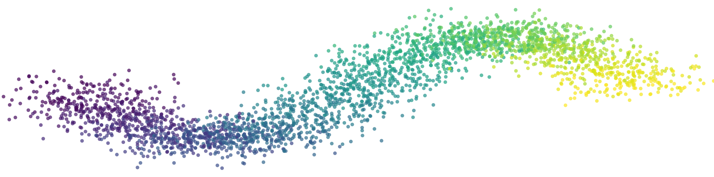
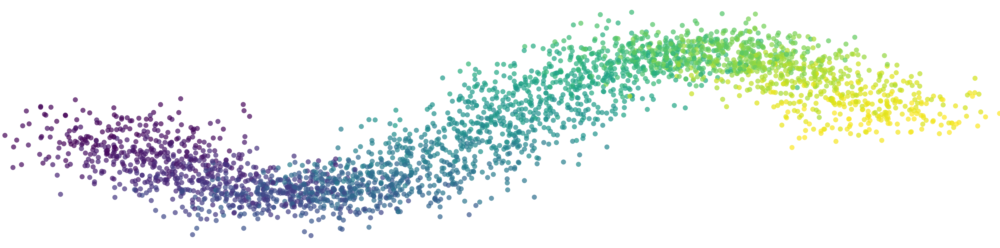

# 🎨 Timeseries Drifting Data Banner

A Python script that generates a **high-resolution banner** featuring a **sine wave of drifting data points**, perfect for LinkedIn or other profile headers. The points flow along a **smooth wave** with an optional **watercolor background** or a **transparent background**.


---

## 🚀 Features

- **Drifting Data Points** — Simulates concept drift in time series data.
- **Customizable Sine Wave** — Adjust amplitude, scatter, and color mapping.
- **Background Options** — Use a custom image (`bg.png`), a plain white background, or a fully transparent one.
- **High-Resolution Output** — Suitable for LinkedIn (or other profile headers).

---

## 📦 Installation

Ensure you have Python installed, then install dependencies:

```sh
pip install numpy matplotlib
```

---

## 🎯 Usage

Run the script to generate a banner:

```sh
python banner_generator.py
```

By default, the script:
- **Uses `bg.png`** as the background if available.
- **Falls back to a white background** if `bg.png` is missing.
- **Can generate a transparent background** if specified.
- **Saves the result as `banner.png`**.

---

## 🛠 Customization

Modify these parameters inside `banner_generator.py`:

| Parameter         | Default | Description |
|------------------|---------|-------------|
| `n_points`       | `3000`  | Number of data points. |
| `amplitude_factor` | `0.3` | Controls sine wave height (as fraction of image height). Increase for a bigger wave. |
| `scatter_factor` | `0.05` | Controls how widely points are spread around the wave. Increase for more randomness. |
| `cmap` | `'viridis'` | Colormap for the points. Try `'plasma'`, `'magma'`, or a single color. |
| `BACKGROUND_MODE` | `'auto'` | Options: `'auto'` (use `bg.png` if available, else white), `'white'` (force white), `'transparent'` (no background). |

Example: To generate a **higher wave with more scattered points**, update:

```python
amplitude_factor=0.5  # Taller wave
scatter_factor=0.10   # More spread-out points
```

To **generate a transparent PNG**, set:

```python
BACKGROUND_MODE = "transparent"
```

---

## 🖼️ Example Outputs

### With a Background
Using `bg.png` as the backdrop:


### Plain White Background
No background image:



### Transparent Background
Saved as `banner.png` with alpha channel:



---

## 📜 License

This project is licensed under the **MIT License**, meaning you can freely use, modify, and distribute it, provided you **credit the original author**.

---

## ❤️ Credits

Created by AliD101v

`bg.png` by ©Ermedia Studio via [Canva.com](https://www.canva.com/)

If you find this useful, ⭐ **star this repo** and feel free to **share your banners!** 🚀

